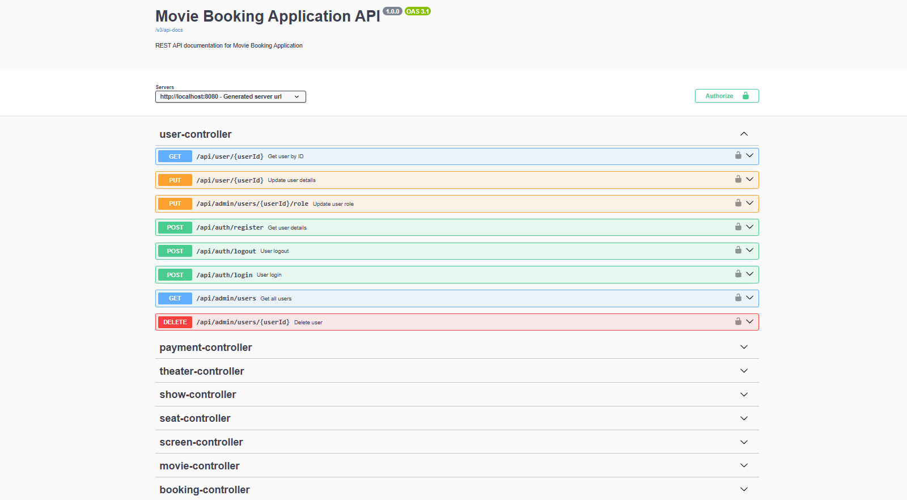

# 🎬 Movie Booking Application - Backend

A **Spring Boot based backend** for a movie ticket booking system.  
This service provides REST APIs for **authentication, movies, theatres, showtimes, and bookings** with role-based access for **Users and Admins**.  

---

## 🚀 Features
- JWT-based Authentication & Authorization  
- Role-based access (USER & ADMIN)  
- Movie & Theatre management  
- Show scheduling  
- Ticket booking & cancellation  
- Swagger UI API documentation  

---

## 🛠️ Tech Stack
- **Backend**: Spring Boot, Spring Security, Spring Data JPA, Hibernate  
- **Database**: MySQL  
- **Build Tool**: Maven  
- **API Documentation**: Swagger (Springdoc OpenAPI)  

---

## 📦 Setup

### Prerequisites
- Java 17+  
- Maven 3+  
- MySQL  

### Steps
```bash
# clone repository
git clone https://github.com/your-username/movie-booking-backend.git
cd movie-booking-backend

# configure MySQL in application.properties
spring.datasource.url=jdbc:mysql://localhost:3306/movie_booking
spring.datasource.username=root
spring.datasource.password=your_password

# run application
mvn spring-boot:run

## 📌 REST API Endpoints  

### 🔐 Authentication

| Method | Endpoint             | Description |
|--------|----------------------|-------------|
| POST   | `/api/auth/register` | Register a new user |
| POST   | `/api/auth/login`    | Authenticate user & return JWT token |
| GET    | `/api/auth/profile`  | Get logged-in user details |

| Method | Endpoint              | Role   | Description |
|--------|-----------------------|--------|-------------|
| GET    | `/api/movies`         | USER   | Get all movies |
| GET    | `/api/movies/{id}`    | USER   | Get movie details by ID |
| POST   | `/api/movies`         | ADMIN  | Add a new movie |
| PUT    | `/api/movies/{id}`    | ADMIN  | Update movie details |
| DELETE | `/api/movies/{id}`    | ADMIN  | Delete a movie |

| Method | Endpoint              | Role   | Description |
|--------|-----------------------|--------|-------------|
| GET    | `/api/theatres`       | USER   | Get all theatres |
| GET    | `/api/theatres/{id}`  | USER   | Get theatre details by ID |
| POST   | `/api/theatres`       | ADMIN  | Add a new theatre |
| PUT    | `/api/theatres/{id}`  | ADMIN  | Update theatre details |
| DELETE | `/api/theatres/{id}`  | ADMIN  | Delete a theatre |

| Method | Endpoint              | Role   | Description |
|--------|-----------------------|--------|-------------|
| GET    | `/api/shows`          | USER   | Get all shows |
| GET    | `/api/shows/{id}`     | USER   | Get show details by ID |
| POST   | `/api/shows`          | ADMIN  | Create a new showtime |
| PUT    | `/api/shows/{id}`     | ADMIN  | Update showtime |
| DELETE | `/api/shows/{id}`     | ADMIN  | Delete showtime |

| Method | Endpoint              | Role   | Description |
|--------|-----------------------|--------|-------------|
| GET    | `/api/bookings`       | USER   | Get all bookings of logged-in user |
| GET    | `/api/bookings/{id}`  | USER   | Get booking details by ID |
| POST   | `/api/bookings`       | USER   | Book tickets for a show |
| DELETE | `/api/bookings/{id}`  | USER   | Cancel booking |

| Method | Endpoint              | Description |
|--------|-----------------------|-------------|
| GET    | `/api/users`          | Get all users |
| GET    | `/api/users/{id}`     | Get user details |
| DELETE | `/api/users/{id}`     | Delete a user |

## Swagger-UI-Snippet




